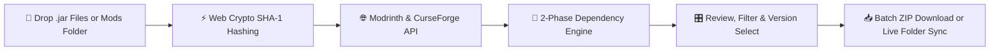

<div align="center">

# 🎮 Minecraft Mods Updater (MC Mod Updater)

**The ultra-fast, privacy-first web application for batch updating Minecraft mods, resolving dependency graphs, and sharing modpack profiles across Fabric, NeoForge, Forge, and Quilt.**

[](https://mcmods.sednium.com)
[](https://mods-updater-minecraft.vercel.app/)
[](LICENSE)
[](https://github.com/CoderBhoid/Minecraft-Mods-Updater/stargazers)

---

[🚀 Launch Web App](https://mcmods.sednium.com) • [✨ Features](#-key-features) • [⚡ How It Works](#-how-it-works) • [📦 Architecture](#-architecture--data-flow) • [🛠️ Local Setup](#-local-development--setup) • [🤝 Contributing](#-contributing)

---

</div>

## 🌟 Why MC Mod Updater?

Keeping Minecraft mods updated across major game versions (e.g. `1.20.1`, `1.21.4`, `26.2`) is usually a tedious loop of hunting down JARs, cross-referencing compatibility tables, and debugging missing dependency crashes.

**MC Mod Updater runs 100% in your browser** to automate the entire process:
- ⚡ **Zero Installation**: No `.exe` or desktop app required. Open in any modern web browser.
- 🔒 **100% Private & Client-Side**: Your files never leave your computer. Checksums are calculated locally using the Web Cryptography API.
- 🧩 **Smart Two-Phase Dependency Engine**: Automatically detects required companion libraries (Fabric API, Cloth Config, Architecture API) and eliminates false-positive alerts.
- 🔗 **1-Click Modpack Sharing**: Generate instant web links to share your exact mod setup with friends or server members.
- 💾 **Direct Folder Sync**: Connect directly to your `.minecraft/mods` folder with the File System Access API.

---

## ✨ Key Features

```
┌────────────────────────────────────────────────────────────────────────┐
│                        MC MOD UPDATER CORE SUITE                       │
├────────────────────┬────────────────────┬──────────────────────────────┤
│ 🔍 Smart Hashing   │ 🧩 Dependency Graph│ 👥 Profile Sharing           │
│ SHA-1 + Fuzzy API  │ Two-Phase Resolver │ Direct URLs + JSON Manifests │
├────────────────────┼────────────────────┼──────────────────────────────┤
│ 🎛️ Version Selector│ 📁 Local Folder Sync│ 📋 Formatted Copy            │
│ Alpha/Beta/Release │ Chrome File System │ Discord / Markdown / Text    │
└────────────────────┴────────────────────┴──────────────────────────────┘
```

### 1. 🔍 Intelligent Mod Identification
- **Cryptographic SHA-1 Verification**: Generates local hashes in browser workers to match exact mod versions against Modrinth & CurseForge.
- **Smart Semantic Fallback**: Automatically cleans filenames (e.g. `fabric-sodium-mc1.20.1-0.5.8.jar` → `sodium`) to locate projects even if the JAR was custom-built or renamed.

### 2. 🧩 Two-Phase Dependency Resolution
- **Phase 1**: Sequential hashing and identification of all loaded mods.
- **Phase 2**: Evaluates project dependencies against your **entire modpack**, highlighting only truly missing companion libraries.
- **1-Click Resolver**: Adds missing dependencies directly to your batch download queue.

### 3. 👥 Modpack Profiles & Direct Web Sharing
- **Profile Manager**: Create, save, edit, clone, and switch between separate mod configurations (e.g. *"1.21.4 Performance Pack"*, *"1.20.1 RPG Survival"*).
- **Direct Share Links**: Share direct web links (`https://mcmods.sednium.com/?profile=...`) that prompt visitors to auto-import and load the profile into their session with one click.
- **JSON Manifests**: Download and import standard JSON modpack manifests.
- **Multi-Format Mod Lists**: 1-click copy formatted mod lists for **Discord code blocks**, **Markdown tables**, or **Plain Text**.

### 4. 🎛️ Per-Mod Release & Version Picker
- Browse all available releases for any individual mod.
- Filter and switch between **Release** (stable), **Beta**, and **Alpha** builds with release notes, file sizes, and release dates.

### 5. 📁 Live Folder Synchronization
- Connects directly to `.minecraft/mods` using the browser's **File System Access API**.
- Download and write updated `.jar` files straight into your game folder with automated cleanup of outdated files.

---

## ⚡ How It Works

<div align="center">



</div>

<details>
<summary><b>🕹️ Click to view the Interactive Status Matrix</b></summary>
<br>

| Badge / Status | Meaning | Action Taken |
| :--- | :--- | :--- |
| <kbd style="color:#1bd96a; font-weight:bold;">🟢 UPDATE AVAILABLE</kbd> | Newer compatible JAR found for your target loader & MC version | Ready for 1-click download or sync |
| <kbd style="color:#60a5fa; font-weight:bold;">🔵 UP TO DATE</kbd> | You already have the latest compatible release installed | Kept as-is |
| <kbd style="color:#f59e0b; font-weight:bold;">🟡 MISSING DEPENDENCY</kbd> | Required library (e.g. Fabric API) is missing from your pack | 1-Click "Add Dependency" |
| <kbd style="color:#ef4444; font-weight:bold;">🔴 NOT FOUND</kbd> | Custom compiled build or mod not indexed on Modrinth | Search override enabled |
| <kbd style="color:#a855f7; font-weight:bold;">🟣 PINNED</kbd> | User locked mod to prevent accidental updates | Preserved at current version |

</details>

---

## 📦 Architecture & Data Flow

```
mc-mod-updater/
├── App.tsx                    # Main App Controller & State Orchestration
├── components/
│   ├── ModCard.tsx            # Mod Card UI, Version Selector Popover & Overrides
│   ├── ModFilterBar.tsx       # Search, Sort, Status Filters & Mod List Exporter
│   ├── ProfileManagerModal.tsx# Profile Drawer, JSON Manifests & Share Dialog
│   ├── DependencyGraphModal.tsx# Full Modpack Dependency Resolver Modal
│   ├── FolderSyncModal.tsx    # Live File System Access API Connector
│   ├── ChangelogModal.tsx     # Markdown Release Notes Viewer
│   ├── LandingPage.tsx        # Zero-State Dropzone & Hero Overview
│   └── ToastContainer.tsx     # Non-intrusive Toast Notification System
├── hooks/
│   ├── useMods.ts             # 2-Phase Hash & Dependency Pipeline
│   ├── useModSettings.ts      # Settings, Filters & Live Version Sync
│   ├── useProfiles.ts         # Persistent Modpack Profiles Hook
│   └── useFolderSync.ts       # Chromium File System Sync Interface
├── services/
│   ├── modrinth.ts            # Modrinth REST API v2 Client
│   └── curseforge.ts          # CurseForge Core API Client
├── utils/
│   ├── fileHelpers.ts         # SHA-1, Manifest Builder & Base64 Share Encoder
│   └── storage.ts             # Safe LocalStorage Layer
└── public/
    ├── llms.txt               # LLM Search Engine Documentation Standard
    ├── ai.txt                 # Machine-Readable AI Crawler Directives
    └── manifest.json          # PWA / Mobile Web App Manifest
```

---

## 🛠️ Local Development & Setup

### Prerequisites
- [Node.js](https://nodejs.org/) (v18.0.0 or higher)
- [npm](https://www.npmjs.com/) or [pnpm](https://pnpm.io/)

### 1. Clone the Repository
```bash
git clone https://github.com/CoderBhoid/Minecraft-Mods-Updater.git
cd Minecraft-Mods-Updater
```

### 2. Install Dependencies
```bash
npm install
```

### 3. Start Development Server
```bash
npm run dev
```
Open **`http://localhost:3000`** in your browser.

### 4. Build for Production
```bash
npm run build
```
Generates a complete static distribution in `./dist` ready to deploy on Vercel, Netlify, or GitHub Pages.

---

## 🌐 Supported Environments & Loaders

<div align="center">

| Mod Loader | Status | Compatibility Notes |
| :---: | :---: | :--- |
| **Fabric** | ✅ Supported | Full dependency & companion library resolution |
| **NeoForge** | ✅ Supported | Full support for modern 1.20.4+ and 26.x releases |
| **Forge** | ✅ Supported | Legacy & modern Forge support with version fallbacks |
| **Quilt** | ✅ Supported | Quilt Standard Libraries (QSL) & Fabric compatibility |

</div>

---

## 🤖 AI & LLM Search Standards

This repository conforms to modern AI search and discoverability standards:
- 📄 [`/llms.txt`](https://mcmods.sednium.com/llms.txt): High-signal contextual documentation for LLM search engines (Perplexity, ChatGPT, Claude, Gemini).
- 📜 [`/llms-full.txt`](https://mcmods.sednium.com/llms-full.txt): Comprehensive API & schema reference.
- ⚡ [`/ai.txt`](https://mcmods.sednium.com/ai.txt): Machine-readable indexing and citation permissions.

---

## 🤝 Contributing

Contributions make the open-source community an amazing place to learn, inspire, and create. Any contributions you make are **greatly appreciated**!

1. Fork the Project
2. Create your Feature Branch (`git checkout -b feat/AmazingFeature`)
3. Commit your Changes (`git commit -m 'feat: add some amazing feature'`)
4. Push to the Branch (`git push origin feat/AmazingFeature`)
5. Open a Pull Request

---

## 📄 License

Distributed under the **MIT License**. See [`LICENSE`](LICENSE) for more information.

---

<div align="center">
  <p>Built with ❤️ by <b><a href="https://github.com/CoderBhoid">Bhoid</a></b> for the Minecraft community.</p>
  <p>Powered by <b><a href="https://sednium.com">Sednium</a></b></p>
  <br />
  <p style="font-size: 0.75rem; color: #71717a;">
    <b>Disclaimer:</b> NOT AN OFFICIAL MINECRAFT PRODUCT. NOT APPROVED BY OR ASSOCIATED WITH MOJANG OR MICROSOFT.
  </p>
</div>
